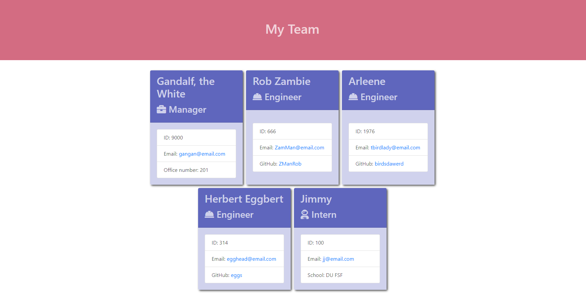

# Object-Oriented Programming: Team Profile Generator
# team-profile-generator

## Description

In this project I build a Node.js command-line application that takes in information about employees on a software engineering team, then generates an HTML webpage that displays summaries for each person. The code has built in tests that ensure each component is working properly.

## Project Link
* GitHub URL: https://purpleamaranth.github.io/team-profile-generator/
* Sample index.html: https://purpleamaranth.github.io/team-profile-generator/

## Walkthrough Video

https://user-images.githubusercontent.com/36141949/126740718-45ea173a-115e-437f-a889-9d79c263d6ff.mp4

## User Story

```
AS A manager
I WANT to generate a webpage that displays my team's basic info
SO THAT I have quick access to their emails and GitHub profiles
```

## User Flow

```
***Instructions***

To generate a team webpage input member data in the terminal using inquirer.
Invoke the command line in the terminal using the command "Node index.js".
Once completed an HTML file is generated that displays each member and their data.
If you click on an employee address or GitHub link, you will be navigated to your default email program or their GitHub webpage.

Once the application is initialized you are prompted to enter in the team manager’s name, employee ID, email address, and office number.
You are then presented with a menu with the option to add an engineer or an intern or to quit creation.
If you select the engineer option, then you are prompted to enter the engineer’s name, ID, email, and GitHub username and taken back to the main menu.
If you select the intern option, then you are prompted to enter the intern’s name, ID, email, and school, and taken back to the menu.
If you quit, then the application exits and an index.html is generated to display a webpage using the static style.css in the output.

```

## Mock-Up

The following image shows a mock-up of the generated HTML’s appearance and functionality:



The styling in the image is just an example, yours will display the information you choose.

## Technology Used

The application uses [Jest](https://www.npmjs.com/package/jest) for running the unit tests and [Inquirer](https://www.npmjs.com/package/inquirer) for collecting input from the user. The application will be invoked by using the following command:

```bash
node index.js
```

The test directory structure looks like the following example:

```
__tests__/			// jest tests
  Employee.test.js
  Engineer.test.js
  Intern.test.js
  Manager.test.js
lib/				// classes
output/               // rendered output (HTML) and CSS style sheet
src/				// template helper code
index.js			// runs the application
index.html //example
style.css //example
```

The application includes `Employee`, `Manager`, `Engineer`, and `Intern` classes. The tests for these classes (in the `_tests_` directory) should ALL pass.

The first class is an `Employee` parent class with the following properties and methods:

* `name`

* `id`

* `email`

* `getName()`

* `getId()`

* `getEmail()`

* `getRole()`&mdash;returns `'Employee'`

The other three classes will extend `Employee`.

In addition to `Employee`'s properties and methods, `Manager` will also have the following:

* `officeNumber`

* `getRole()`&mdash;overridden to return `'Manager'`

In addition to `Employee`'s properties and methods, `Engineer` will also have the following:

* `github`&mdash;GitHub username

* `getGithub()`

* `getRole()`&mdash;overridden to return `'Engineer'`

In addition to `Employee`'s properties and methods, `Intern` will also have the following:

* `school`

* `getSchool()`

* `getRole()`&mdash;overridden to return `'Intern'`

Finally, the code requires input validation to ensure that user input is in the proper format.
